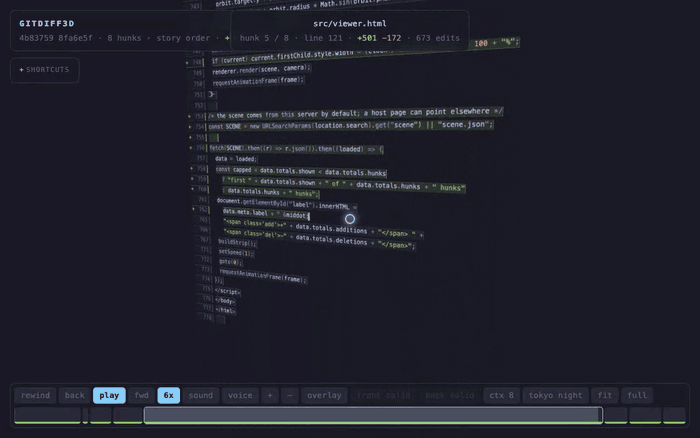
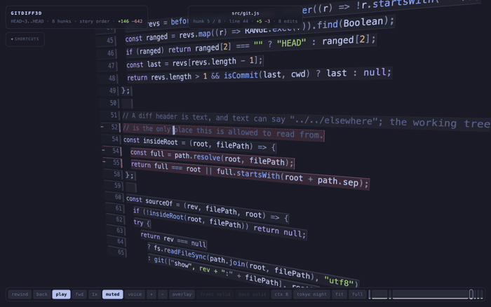

# gitdiff3d

```
  BEFORE                            NOW
  human writes 50 lines             agent writes 2000
  human remembers the order         nobody remembers anything
  human reads 50 lines              human must read 2000
        |                                   |
   reading is cheap                  reading IS the bottleneck
```

A git diff is a pile of text. Somebody typed that text, one key at a time, in
some order that made sense to them. `gitdiff3d` plays it back: your diff becomes
a 3d scene where every changed line is a plate floating in space, and a caret
walks through them typing the additions in and erasing the deletions.



## Install

```
npm i -g github:vdayanand/gitdiff3d
```

That puts `gitdiff3d` on your path. To try it once and install nothing:

```
npx github:vdayanand/gitdiff3d
```

To hack on it, work from a checkout instead, where the link points at your
working tree and your edits are live:

```
git clone https://github.com/vdayanand/gitdiff3d
cd gitdiff3d
make install          # symlinks bin/gitdiff3d.js into ~/bin
```

Node 18 or newer. No dependencies: three.js is vendored, everything else is the
standard library and the `git` already on your path. To remove it, `npm rm -g
gitdiff3d`, or `make uninstall` for the checkout.

## Use

```
gitdiff3d                    working tree vs HEAD
gitdiff3d --staged           the index
gitdiff3d HEAD~3..HEAD       a commit range
gitdiff3d main HEAD          two revisions
gitdiff3d -- src/            limit to a path
```

It builds the scene, serves it on a random local port, and opens your browser.

```
--port <n>        listen on port n (default: random)
--max-hunks <n>   keep only the first n hunks (default: all)
--order <how>     story or git (default: story)
--context <n>     lines of unchanged code around each hunk (default: 8)
--json            print the scene model, do not serve
--no-open         serve without opening a browser
```

## Typing: it defeats skimming

A hunk does not simply appear, it gets typed: deletions erase, additions type
in, and the camera follows the caret. Pause it, step it one keystroke at a time,
or wind the speed up.



```
  ALL AT ONCE                     ONE AT A TIME
  40 lines land in one glance     line 1  ->  read
  ||||||||||||||||||||||          line 2  ->  read
  working memory holds ~4         line 3  ->  read
  brain: "looks fine"             brain has no choice
```

Two separate things happen here. Working memory holds about four chunks, so a
40-line hunk shown at once cannot be read, only pattern-matched, and the honest
name for that is skimming. Separately, a sequence implies cause and effect, and
people remember stories far better than lists, which is what `--order story` is
really buying.

## Story order

Git prints hunks in path order, which is alphabetical, which is nobody's
thinking. The default `--order story` reorders them the way the change was
probably made: a hunk that introduces a name comes before the hunks that call
that name, and failing that, schema before models before logic before callers
before tests before prose. It is a topological sort over "who defines what",
with the file's role as the tie breaker. `--order git` turns it off.

## Overlay: it defeats change blindness

Press `l` and the old version of the hunk sits behind the new one, both in
frame, separated in depth rather than side by side. This is the one thing a flat
diff cannot do. That is the animation at the top of this page.

```
  SIDE BY SIDE                        OVERLAY
  old          new                    new   (front plane)
  +--------+   +--------+             +--------+
  | a b c  |<->| a b d  |             | a b d  |
  +--------+   +--------+             |.a.b.c..|  old (behind)
                                      +--------+
  eye jumps left-right                no jump
  memory must hold one side           both land on the same retina spot
  while looking at the other          difference pops out by itself
```

This is the blink comparator. Tombaugh found Pluto by flickering two
photographic plates in the same position and letting the one moving dot jump out
at him. Nobody finds a moving dot by looking at two plates side by side, because
that turns a preattentive pop-out into a memory task. The `l` key does the same
trick with depth instead of flicker.

## Keys

```
space  pause            ,  .  a keystroke back or forward
<  >   a whole line     b  r  rewind this hunk
arrows previous or next hunk       a  autoplay through everything
j / k  scroll           wheel, ctrl-wheel zoom, shift-wheel sideways
drag   orbit            0  refit the camera and follow the caret
c      more or less context (refetched from git)
l      overlay          g / G  fade the front or back plane
t / T  next or previous theme        f  fullscreen
x / X  faster or slower m  keystroke sound      v  speak the file and symbol
?      show or hide the shortcuts
```

Twelve editor themes, dark and light: tokyo night, dracula, one dark, nord,
gruvbox, solarized, github light, one light, gruvbox light, everforest light,
mint. A theme names only the colours an editor names; the papers, rims and
chrome are mixed from those, so nothing needs a table of shades.

## How it works

```
git diff -U8  ->  parse-diff  ->  structure  ->  layout  ->  order  ->  viewer
                  hunks and       which symbol   scene      story     three.js,
                  lines           each hunk is   model      sort      one plate
                                  inside                              per line
```

The server holds the scene model and re-runs the diff only when you ask for a
different context width. Everything the browser needs is one JSON document plus
one HTML file, so the viewer is dumb on purpose: it draws what it is given.

Source structure is understood by regex, not by a real parser. It knows c-like
languages (js, ts, go, rust, java, kotlin, swift, c#, c, c++, php, scala, dart),
python, julia and ruby well enough to name the function a hunk lands in and to
tell a comment-only change from a real one. Other languages still render, they
just get no symbol names and no story order.

Binary files are skipped. Very long lines are clipped to 200 characters.

## Written with Claude

This tool was built with Claude Code: the diff parser, the structure and layout
passes, the story ordering, the 3d viewer, and this page. It is a small enough
program to read end to end, and reading it is the only way to trust it.

## Licence

GNU General Public License, version 3 or later. See [LICENSE](LICENSE).

Bundles [three.js](https://threejs.org) r128, which is MIT, and MIT is
compatible with the GPL.
